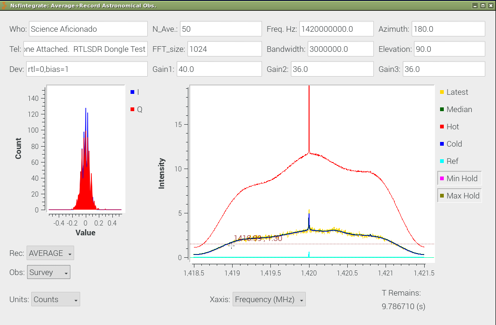
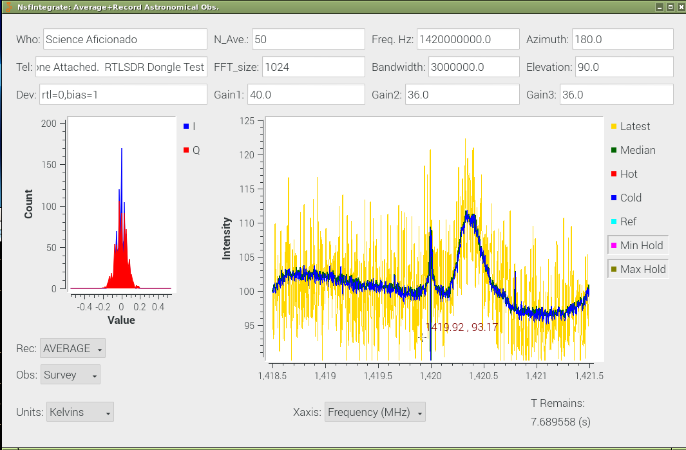
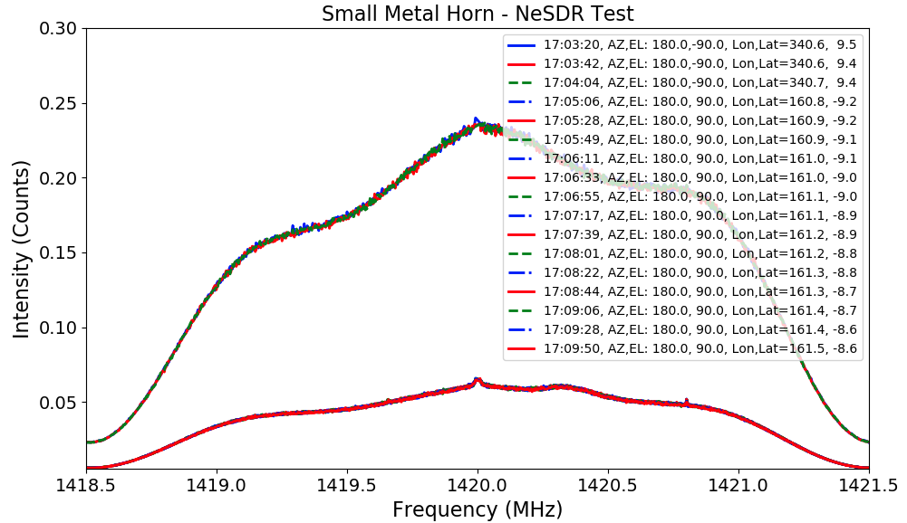
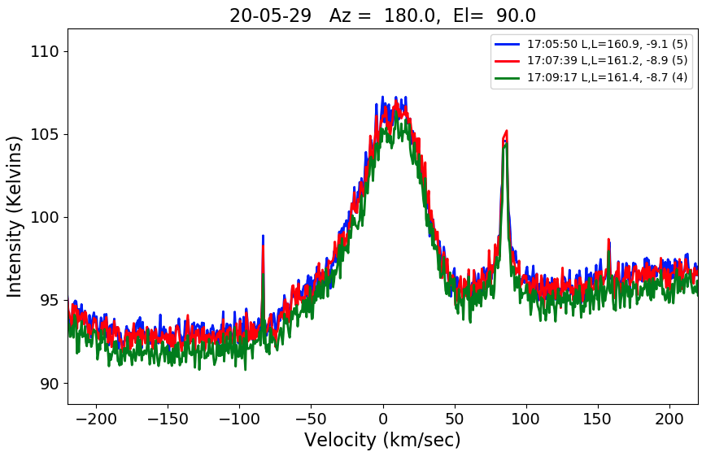

# gr-radio_astro

##  This repository contains Radio Astronomy designs for observations of Neutral Hydrogen.   

These designs, in the examples directory, build on Gnuradio capabilities.  
The different design names indicate the bandwidths of the observations and
provide a hint as to the type of Software Defined Radio (SDR) used.

There are two major groups of designs, one for integration observations of spectra (NsfIntegrate??) and
one for simultaneous detection of transient events and also observations of radio spectra (NsfWatch??).
Because the computer load for transients and spectra the some of the plotting functions are removed in the NsfWatch?? design.

A summary of different Designs and devices is listed below:

1. NsfIntegrate30 - RTL-SDR compatible devices operating with 3.0 MHz bandwidth
2. NsfIntegrate45 - PlutoSdr devices operating at 4.5 MHz and not dropping any samples
3. NsfIntegrate60 - AIRSPY Mini devices at 6.0 MHz
5. NsfIntegrate70 - PlutoSdr devices operating at 7.0 MHz but dropping samples (as high as 12 MHz works, but more samples are dropped).
4. NsfIntegrate90 - SDRPlay RSP 1A at 9.0 MHz
5. NsfIntegrate100 - AIRSPY at 10.0 MHz.

The data analysis tools for gr-radio_astro usually run on different computers than the data acqusition.   The analysis software and documentation have moved to the repository:

http://github.com/glangsto/analyze

These designs use custom python and C++ code.  These programs must be built in the usual manner.

--- 

A build and trouble shooting guide was kindly provided by Dr. Joshua Smith and Zerina Kapetanovic of Univesity of Washington.

# Install Guide

1. Clone the repository and within the gr-XXX folder create a build folder

`mkdir build`

2. Change directory into the build folder

`cd build`


3. run the following commands

```
cmake ../
sudo make
sudo make install
sudo ldconfig
```

4. Run GNU Radio Companion to check if the modules were installed. Search for ra in the GRC block search are on the right side of the GRC console.

# Troubleshooting

If you happen to get an error along the line of "no module found xxx" then make sure that the python files from gr-XXX are in your PYTHONPATH. You can added them to your path following the steps below

1. Open your .bashrc file in an editor

2. In the file add the following command

`export PYTHONPATH="${PYTHONPATH}:path/to/gr-XXX/python/"`

where `path/to/gr-XXX/python/` should be changed to the appropriate path on your PC

# Example Interface - Tests with NeSDR, NooElec HI amplifier and Small metal Horn.

This example shows successful observations of the Milky Way with a minimum cost system.   The system includes
the NsfIntegrate30.grc (and NsfIntegrate30.py) observer interface in this repository.

During the observations, the interface can show spectra in raw counts or calibrated in Kelvins, as is shown by the screen
captures of the interface during observations.

<a href="docs/Pi10SmallMetalHorn-HotCold.png">
 
</a>
<a href="docs/Pi10SmallMetalHorn-Kelvins.png"> 

</a>

# Example Data

After the observations, all spectra are recorded in the data directory, containing a series of ascii files,
taged with the observation time.
The data sub-directory contains a few minutes of observations with different SDR types.
Data from 2020-May-29 were made with a minimum sized horn and NeSDR device operating
at 3 MHz bandwidth.   Log include Hot load (the ground) and Cold Sky observations.

The log is summarized with the "analyze S command"

```
S 20-05-29T170*

and yields

Count  Time    Az    El   G-Lon G-Lat  Frequency  BW   Gain    Filename
   1 17:03:20 180.0,-90.0 340.6,  9.5:  1420.00, 3.00  40.0 - 20-05-29T170320.hot
   3 17:04:04 180.0,-90.0 340.7,  9.4:  1420.00, 3.00  40.0 - 20-05-29T170404.hot
   1 17:05:06 180.0, 90.0 160.8, -9.2:  1420.00, 3.00  40.0 - 20-05-29T170506.ast
  14 17:09:50 180.0, 90.0 161.5, -8.6:  1420.00, 3.00  40.0 - 20-05-29T170950.ast
```

The hot and cold load observations are shown with the Raw plot command,"R"

`R 20-05-29T170*`

<a href="docs/SmallHornHotCold.png"> </a>

The calibrated in Temperatre, Kelvins, spectra are shown with the "T" command.

`T 120. 20-05-29T170*`

<a href="docs/SmallHornTcal.png"> </a>

Glen Langston --- National Science Foundation, May 29, 2020

