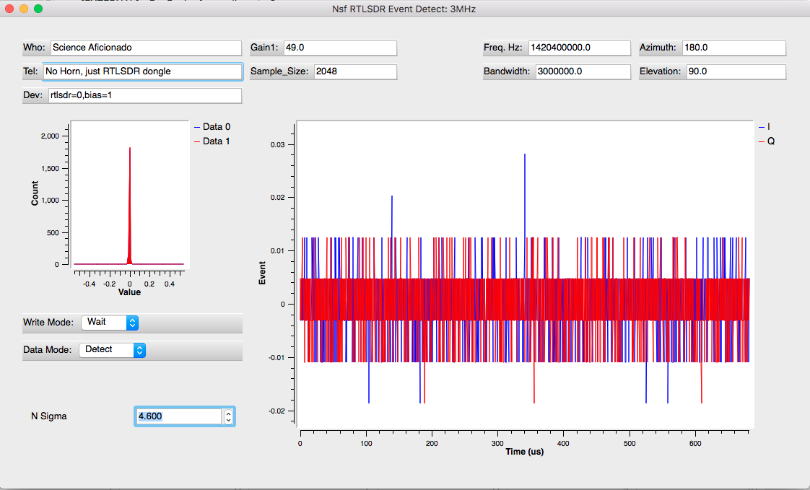

### Radio Astronomy Gnuradio 
There are two main classes of observations described here:
1) Spectral Line observations, where Intensity versus Frequency Spectra are averaged.  The primary use of these observer interfaces is to detect the structure of the Milky Way.
2) Event Detection, where very short duration (< 10 micro-seconds) events are found in the time series of voltage measurements.  When an voltage is found that is significantly (many _sigma_) greater than the average noise in the data stream the event is detected and the time series of voltages are recorded.

### Observer Interface: NsfIntegrate30.grc

The spectra are obtained using the _integrate_ graphs, which average many spectra (in a very short time).
The figure above shows an observation with an RTLSDR dongle (3 MHz, bandwidth) that has no input signal connected.
With the gain turned up sufficiently high, the internal noise of the device is visible.    

The plot on the left shows the histogram of samples for the weak, internal, noise of the dongle.  
The plot at right shows the spectrum of the noise in the dongle.  

The observer must provide the special name used to configure their _device_, the software defined radio.  The observer must also note the horn Azimuth and Elevation (in degrees). The observer can set the observing frequency (Hz) and bandwidth (Hz) also, but might want to create a new graph with gnuradio-companion if making many changes.

Use the _Who_ field to record who made the observations.   Use the _Tel_ field to describe the telescope and purpose of the observations.  You can also increase the accuracy of your spectrum by setting the Fast Fourier Transform (FFT) size.  Increasing the FFT size increases the load on your computer.  This value must be a multiple of 2 (i.e.  64, 128, 256, 512, 1024, 2048 or 4096).

Another graph is setup for observations with an Airspy-mini and 6 MHz bandwidth.  The histogram plot (above left) shows the signal level set for a strong input signal.  The samples range roughly between -0.15 and 0.15, so that events with peaks as high as .99 can be detected.  In this example, the horn had a NooElec HI amplifier, which is intended for Science Aficionados to observe the Milky Way.
The spectrum, at right, shows the observations calibrated in Kelvin units.  The galactic hydrogen signal has a peak 1420.4 MHz.

### Observer Interface: NsfDetect30.grc

The much of the interface above is similar to the spectral line integration interface.  The histogram plot at left,
again shows all the samples are near zero (the red peak).   The plot at right shows the time series of samples.  
The "step" function shows the digital noise of the inputs.   
The samples in this plot are scaled, with minimum and maximum ranging from -1 to 1.  To make astronomical observations, 
the signal must be much stronger than the noise.   When your horn and amplifiers are attached, the input signal level should be at least 10 times higher, roughtly with peak values ranging between -0.15 and 0.15.

After getting a horn and amplifiers attached to the input of the SDR dongle, use the _Gain_ parameter to adjust the signal level.
Then adjust the _sigma_ level so that a few events are detected in a minute.  The peak event should be in the middle of the time series plot if all is working well.   The _sigma_ level indicates how extreme a voltage peak must be to be declared an event.  The lower the sigma level, the more events will be identified.   Setting the Sigma level below 3 will cause many, many events to be detected.   This will fill up your disk very quickly.   Setting _sigma_ around 4 will give a few events a minute.

### Executable Graphs

The executables are in the _examples_ directory.  The GRC files are:

1. NsfDetect30.grc - Detect events (C++ version) at 3 MHz sample rate (both I+Q) using an RTL SDR dongle.

1. NsfDetect60.grc - Detect events (C++ version) at 6 MHz sample rate (both I+Q) using an AIRSPY-Mini dongle.

1. eventdemo.grc - Simple graph block testing the python version of event detection (no hardware needed).

1. detect_log.grc - Simple graph block for  testing the C++ version of event detection (no hardware needed).

1. eventwrite.grc - Event detection (python) with writing of events and logging a summary.  This graph requires a software defined radio.

The data go into the _events_ directory, one directory up from the current directory.

The '*.eve' files contain example event observations. 

The '*.log' files contain logs of events detected.

Configuration files are used to record some input parameters and allow restarting tests and survey observations.

1. Detect60.conf - configuration file for the NsfDetect60.grc AIRSPY 6.0 MHz observing graph

1. Detect30.conf - configuration file for the NsfDetect30.grc RTLSDR 3.0 MHz observing graph

1. Integrate60.conf - configuration file for the NsfIntegrate60.grc AIRSPY 6.0 MHz observing graph

1. Integrate30.conf - configuration file for the NsfIntegrate30.grc RTLSDR 3.0 MHz observing graph

### Installation notes

This repository contains both Python and C++ versions of the event capture software.
The blocks with _detect_ names are the C++ versions.   The blocks with _event_ are the python versions.  Both
versions are prepared and installed using _cmake_.
