# Documentation

## List of Documents:

Note that the detailed documentation of the python pipeline is not located in the readme file under jupyter. The theory will be located there as well

The dedispersed png files such as  show the pulsar after it has been dedispersed.

The dispersed files after this include the dispersed pulsar with noise and without noise. The without noise looks like a dispersed pulse train , while the train with noise looks like .

The waterfall plots that have the diserpsed pulsar on look like . This is what the pulsar looks like after the FFT and integration are done.

The dispersion measure files show the pulsar after it has been dediseprsed and the frequencies for each DM have been summed together. They look like  when noise is added to the signal. The bow ties are barely visible, which indicates this is on the upper end of where the pulse can be detected.

Finally, the SNR plots show the signal to noise ratio of each DM. a graph such as  shows that a pulsar has been identified between the range of DMs where the SNRis greater than ten.

...
...
...

This section will be explaining how the completed flowgraph of the detection works.

* The flowgraph starts by importing the file that we wish to analyze using the file source block. 
 * The parameter asking to repeat the block is set to yes, to ensure that a steady pulse train is run through the flowgraph. 
 * The data type is whatever the instrument saving the data saved it as.
  * Typically, telescopes save int16 data

* The signal is changed into a complex type and run through a PFB filter. 

 
 * The delay from the PFB will be the number of frequency channels that are desired from the FFT. In this case, we will have 400 channels
 * 4 delays are used, and after each delay a different window is used. Then all streams are added together.
  * Each delay is a consecutive integer multiple of the vector length.

* The PFB was the first part of the Spectrometer. Next, the data is run through the FFT conjugate, and integrate blocks. 

 * The number of channels will be the same as the vector length, and a forward transform is needed to convert to frequency space.
 * The decimation in the integrate block determines how many time samples are generated. The value is given by the equation 
  
  * The display_integration variable is a time in seconds that must be less than the observed pulse width. A factor of two is acceptable

* The signal is converted to a float. In the case where the signal is coming from a file, then it is converted to a stream. 

 * The signal is throttled here because the block *on average* regulates the number of units it allows through. The throttle rate for a file does NOT need to be the same as the sampling rate. 
* When calculating in real time, the data is not converted to a stream

* The signal after being throttled is turned back into a vector with a length of the number of frequency channels. The vector stream is then run through another stream to vector block to turn it into a matrix.
 * The new length of the matrix is the number of time samples by frequency channels that we want. The number of time channels is found two ways. 
  * If running from a file, then the number of channels is 
  * If running live data, then there is no *size* of a file. Instead, find a number that is significantly larger than the display integration variable (usually an order of magnitude greater). From this approximation of the period, multiply the value by the number of periods desired in one `"file". This is then the number of samples of your "file".
  
* The signal is then intriduced to the dedispersed block, which has multiple parameters 

 * `stat_dm` is the starting dm that will be observed at.
 * `end_dm`  is the last DMs that will be observed at.
 * `dm_step` indicates how many specific DMs want to be used between the previous two parameters.
 * `f_obs` is the observing frequency which is set to the centre frequency the telescope was observing at in MHz.
 * `bw` is the observing bandwidth of the telescope in MHz. This is generally decided by the sampling rate the data was taken at.
 * `nt` is the number of time samples, the same as in the previous stream to vector block.
 * `t_int` is the time length of each timestep.
  * For a file source, this is found by taking the number of time channels and dividing the duration of the observation in milliseconds by it.
  * For a live source, this is found by taking the number of time channels and dividing by the number that is significantly greater than the pulse width and again multiplying by the number of periods desired in the "file".
 * The block takes an input of size equal to nt*vec_length

* Finally, the signal is detected by the program. 

 * The block takes two inputs. Input zero is the signal, and input one is the noise taken away from the source.
  * the noise is calculated in the noise flowgraph, which is exactly the same up to this point where the noise is saved to a file.
*Both signals are introduced into the Pulse detection block with the following parameters.
 * `nt` parameter is the number of time samples.
 * `pac size` is the length of each pulse packet in terms of time samples.
  * To find this with a either a file or live source 
   * p is the period, or the value that is significantly larger than the pulse width, and the decimation is the value calculated in the integrate block. 
 * The output of the block is determined if the block detects a pulsar or not.
  * If a pulsar is detected, then the matched filter between a gaussian pulse and the data is given.
  * If no pulsar, then the output is given as 0.
  * A pulsar is detected if the SNR is greater than 10 for more than 5 DMs, the program will save that part of the file or raw data. The DM with the higest amplitude is the one saved.

* The output from the detection block is then given to a vector to stream block, where the number of items is the `(number of timesteps)*(len(dms))`.
* This is then given to a time sink. In the event that a pulsar is found, the largest pulse from the DMS that passed are given.

### Pipeline after live pulsar integration

The pipeline will change slightly with the introduction of the pulsar. 
* The frequencies are looked at to see which frequencies are without noise and within the bandpass. Note that the frequencies need to be looked at by hand if unsure what bandpass is or if there is significant noise.

 
  
* These will be used for the calculation. 

* The pipeline diverges from the simulatio pipeline after the data is summed along the frequency axis after dediserpsion.

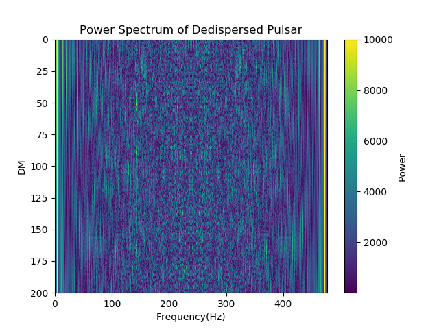

* The fft of the data is found to create a power spectrum

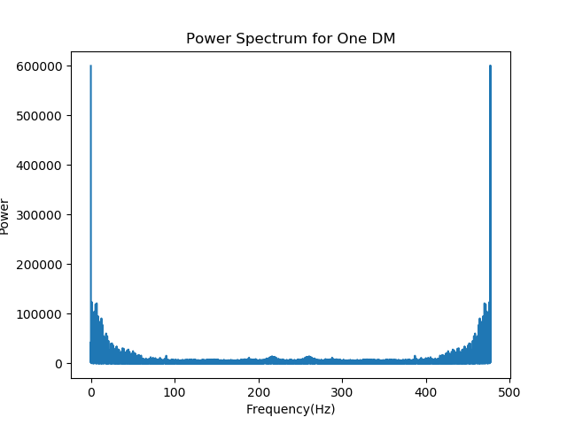

* One DM's power spectrum is shown, and the pulse is easily visible

* A tukey window is applied to the data in order to reduce the noise at the beginning of the plot

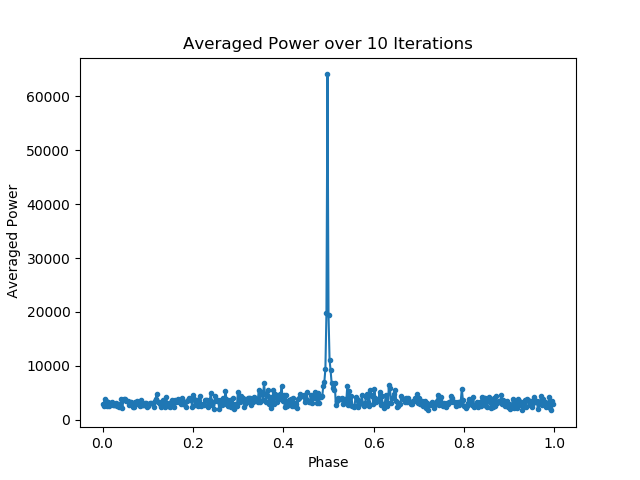

* The pulsar for a known period is summed over the period to produce an averaged pulse

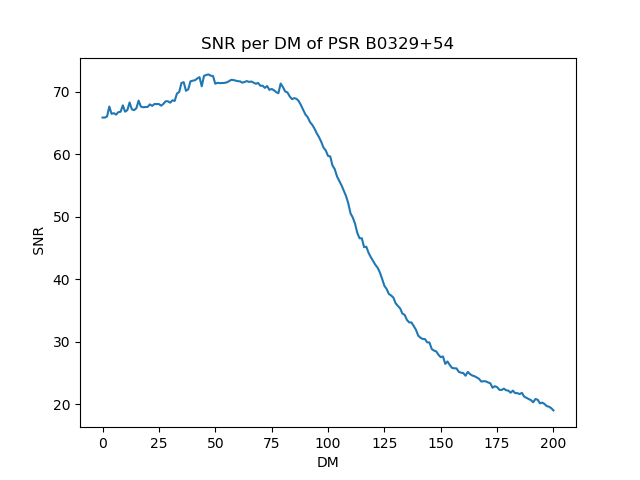

* The SNR is found by taking the peaks of the summed pulses and subtracting them by the mean of the noise, then dividing them by the std of the noise.
 * The noise is created in this case by using values of the data that are within 3 std of the mean

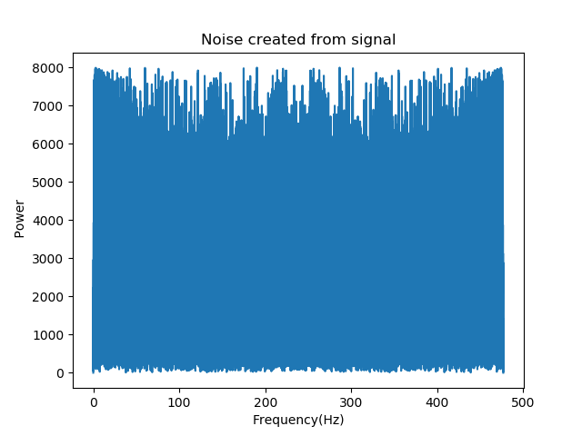

* When a period is not known, the first step is to find the noise and then convolve both the noise and the data with a gaussian pulse
 * A gaussian is used since the ideal cas is white noise, and a matched filter dictates that this is the best filter for this case.
 * The width of this gaussian in the power spectrum is riughly the same no matter your calculation, espacially over a small period of time.
 * The number of points to include should also be small, but that is left up to user discretion

 * When correlating the signal, ensure that for the data, the mode is set to "same", while for the noise, the mode is set to "valid".
  * This will ensure that the same number of DMs will be kept through the convolution, and that non existant numbers don't affect the std and mean of the noise.

* The peaks for the covolved noise are found. However the peaks will decrease as the DM used differs more from the correct DM, so a function is used to ensure that the same number of peaks are found.

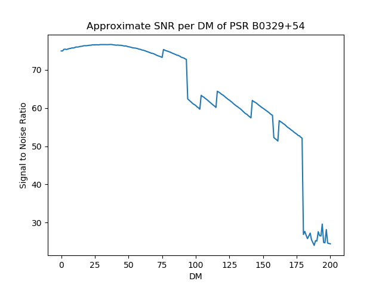

*Similar to before, the mean peaks of the data, and std and mean are of the noise are found.
*This is then used in the equation  for SNR above to find the SNR of an object whose period isnt known.

---------------------------------------------

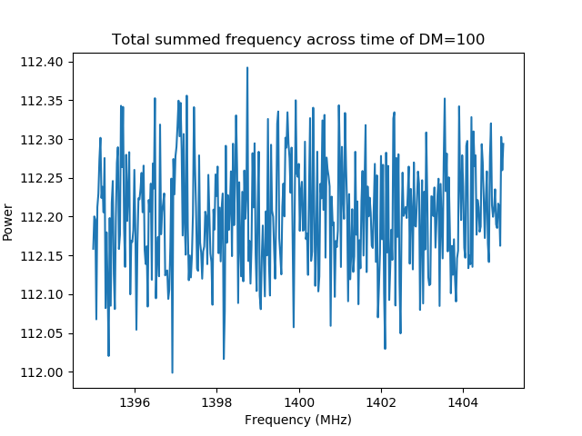

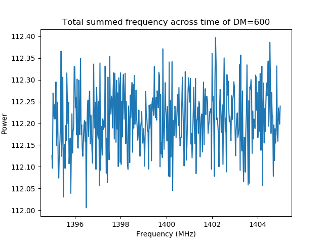

* The same pipeline that was created for the princeton data was used on the simulated data that was created. 
* The total summed frequencies are shown above.

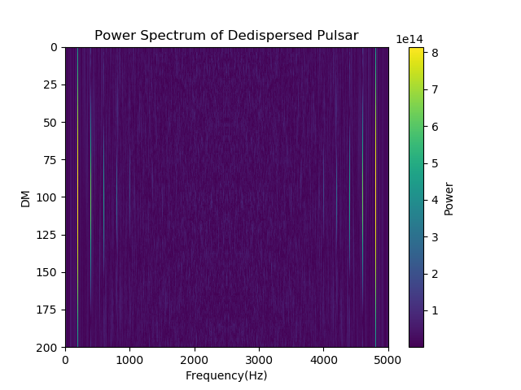

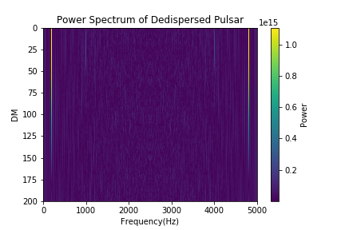

* The power spectrums are shown for each of the three DMs tested
* Each spectrum shows the spikes for the frequency of the pulse (1/.005 s) and the harmonics of it.

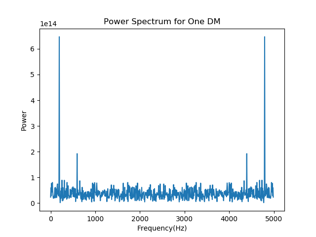

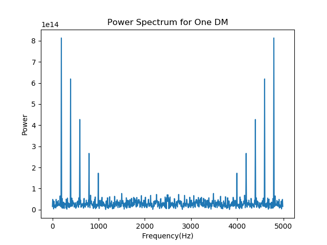

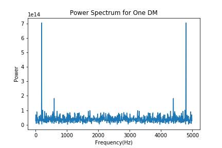

* The power spectrum for one specific DM is shown

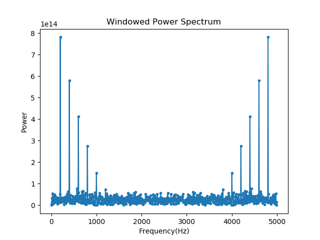

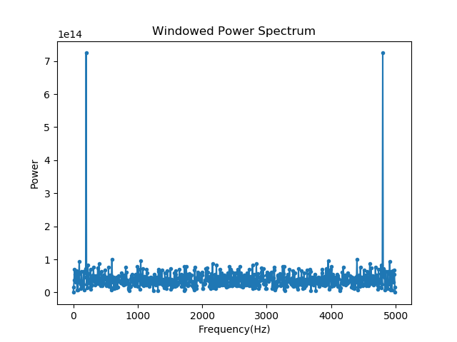

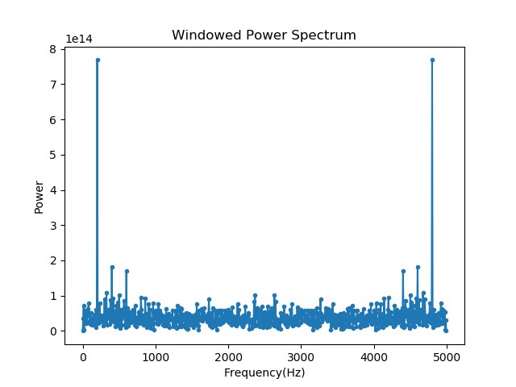

* The tukey window is applied and again as we see, this resembles what was seen with the Princeton data for PSR B0329+54

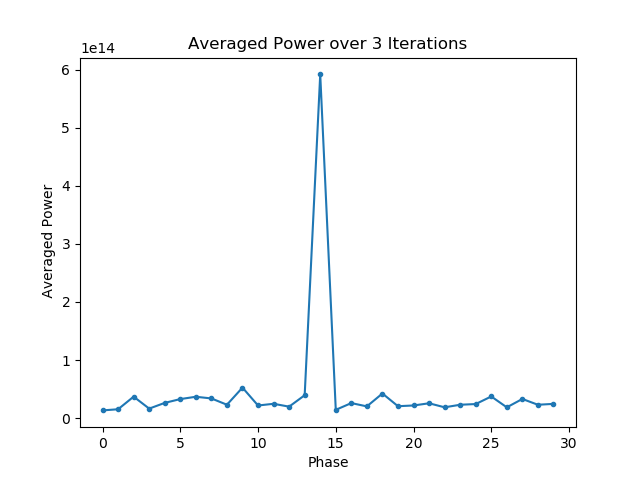

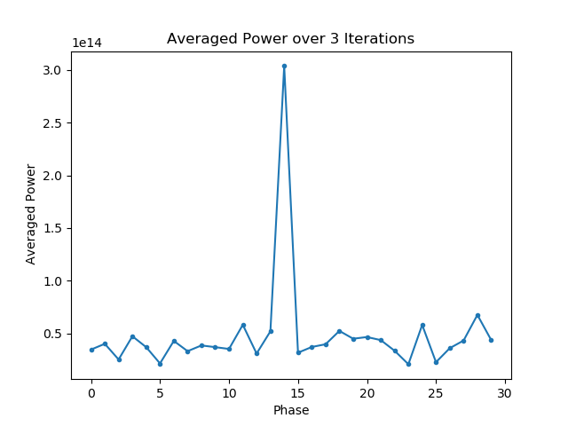

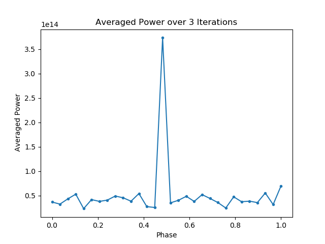

* The period for our simulated pulsar is known and thus we can apply the averaging function
* This yeilds one peak as expected,a dn its magnitude is what it is estimated to be

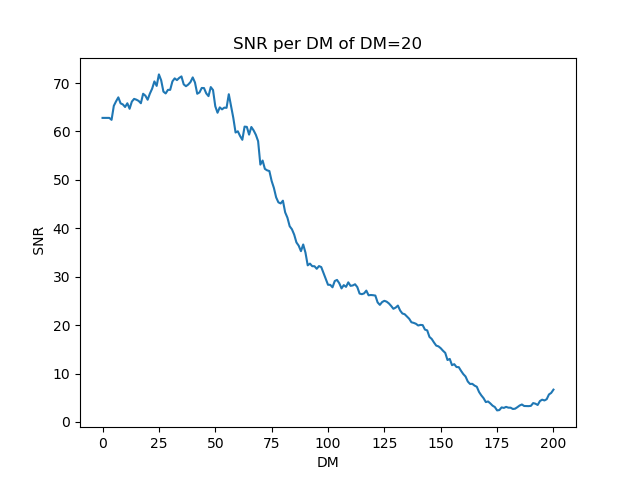

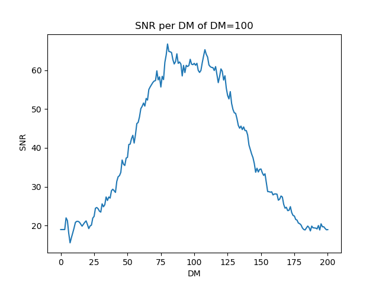

* The SNR is checked to ensuer that a pulsar has been detected.
* In all cases, the SNR near the correct DM is above 10, the threshold being used to determine is something has been detected.
* Note that the peak of the SNR seems to be off from the expected DM, however, this is due to the way that the pulse was simulated.
 * Look to the Princeton data SNr and it can be seen that the correct DM is wher the highest peak is. 
  * Not that this matters much, since the DM that the object is dispersed at is not being looked for, only that the object exists.

*The noise in this case is known, and so it is put through the same reductions as the data.

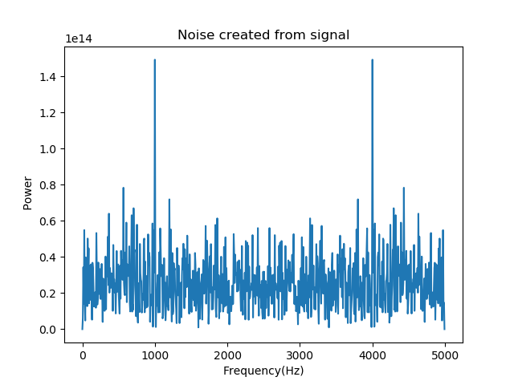

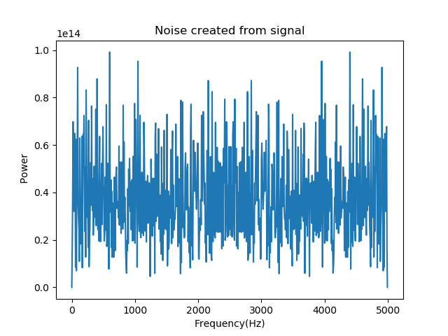

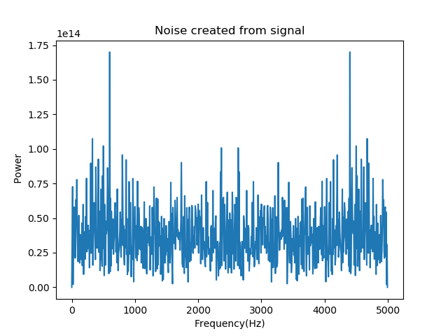

* For the sake of obtuseness, assume that the period is not known, then the noise must be found in the same way as above.

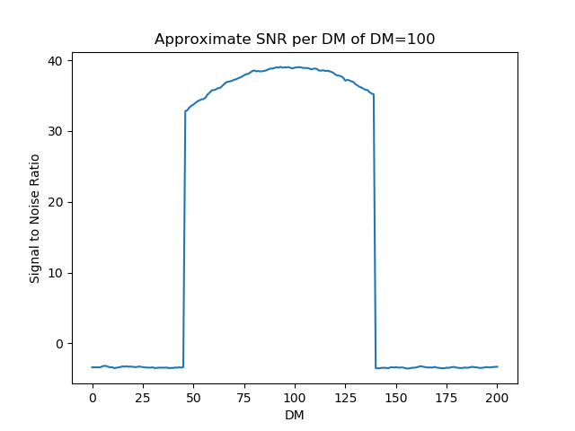

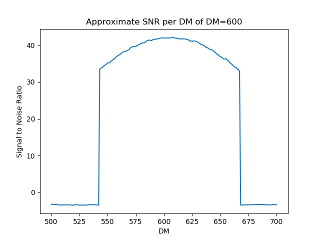

* Following the exact same steps as previously, the SNR is found. 
*When compared to the SNR of the actual pulsar, the shape looks similar, and it can be concluded that the algorithm for finding pulsars works for both simulated and live data
 * This is true so long as the data is clean.
 