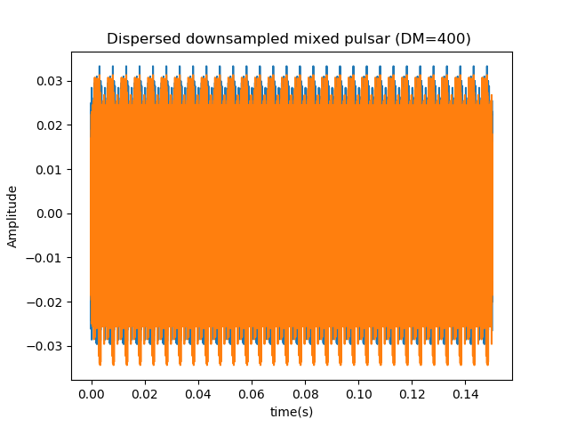
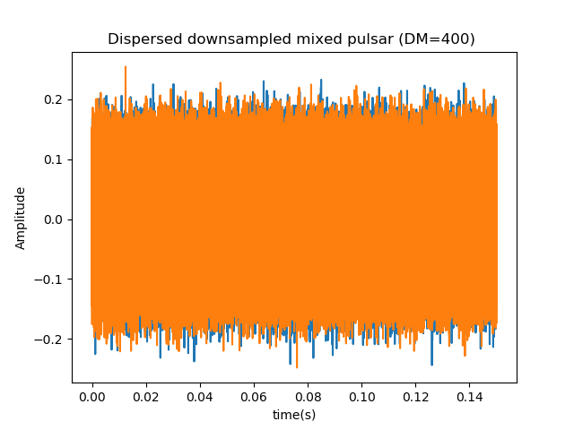
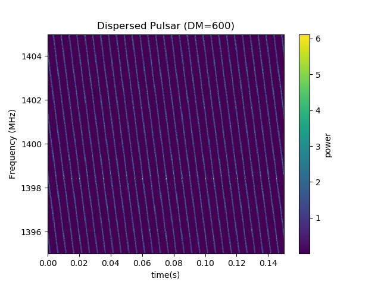
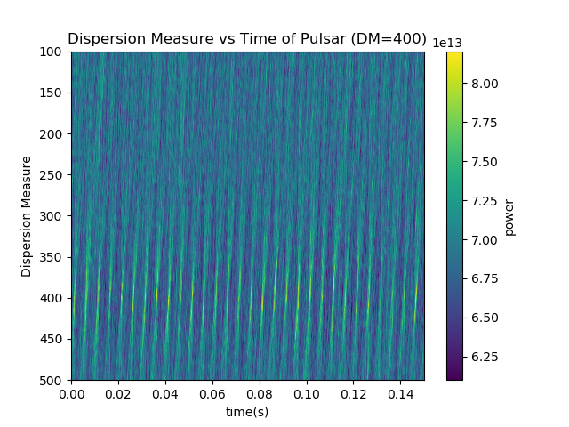
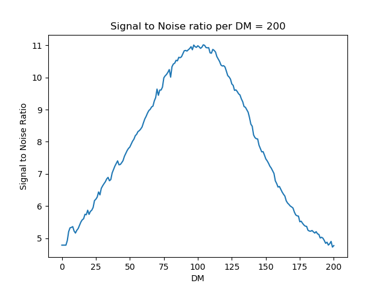
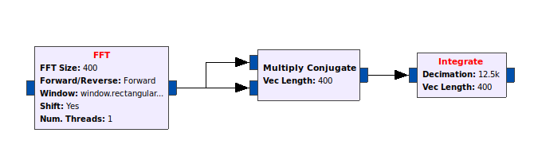
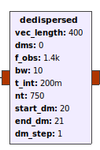
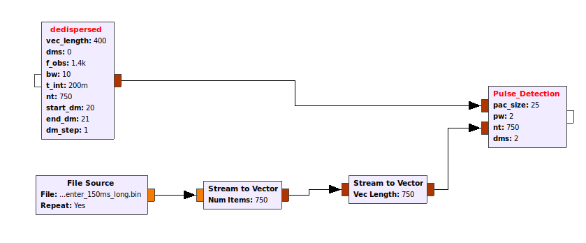

# Documentation

## List of Documents:

Note that the detailed documentation of the python pipeline is not located in the readme file under jupyter. The theory will be located there as well

The dedispersed png files such as  show the pulsar after it has been dedispersed.

The dispersed files after this include the dispersed pulsar with noise and without noise. The without noise looks like a dispersed pulse train , while the train with noise looks like .

The waterfall plots that have the diserpsed pulsar on look like . This is what the pulsar looks like after the FFT and integration are done.

The dispersion measure files show the pulsar after it has been dediseprsed and the frequencies for each DM have been summed together. They look like  when noise is added to the signal. The bow ties are barely visible, which indicates this is on the upper end of where the pulse can be detected.

Finally, the SNR plots show the signal to noise ratio of each DM. a graph such as  shows that a pulsar has been identified between the range of DMs where the SNRis greater than ten.

...
...
...

This section will be explaining how the completed flowgraph of the detection works.

* The flowgraph starts by importing the file that we wish to analyze using the file source block. 
 * The parameter asking to repeat the block is set to yes, to ensure that a steady pulse train is run through the flowgraph. 
 * The data type is whatever the instrument saving the data saved it as.
  * Typically, telescopes save int16 data

* The signal is changed into a complex type and run through a PFB filter. 
 * The delay from the PFB will be the number of frequency channels that are desired from the FFT. In this case, we will have 400 channels
 * 4 delays are used, and after each delay a different window is used. Then all streams are added together.
  * Each delay is a consecutive integer multiple of the vector length.

* The PFB was the first part of the Spectrometer. Next, the data is run through the FFT conjugate, and integrate blocks. 
 * The number of channels will be the same as the vector length, and a forward transform is needed to convert to frequency space.
 * The decimation in the integrate block determines how many time samples are generated. The value is given by the equation 
  * The display_integration variable is a time in seconds that must be less than the observed pulse width. A factor of two is acceptable

* The signal is converted to a float. In the case where the signal is coming from a file, then it is converted to a stream. 
 * The signal is throttled here because the block *on average* regulates the number of units it allows through. The throttle rate for a file does NOT need to be the same as the sampling rate. 
* When calculating in real time, the data is not converted to a stream

* The signal after being throttled is turned back into a vector with a length of the number of frequency channels. The vector stream is then run through another stream to vector block to turn it into a matrix.
 * The new length of the matrix is the number of time samples by frequency channels that we want. The number of time channels is found two ways. 
  * If running from a file, then the number of channels is 
  * If running live data, then there is no *size* of a file. Instead, find a number that is significantly larger than the display integration variable (usually an order of magnitude greater). From this approximation of the period, multiply the value by the number of periods desired in one `"file". This is then the number of samples of your "file".
  
* The signal is then intriduced to the dedispersed block, which has multiple parameters 
 * `stat_dm` is the starting dm that will be observed at.
 * `end_dm`  is the last DMs that will be observed at.
 * `dm_step` indicates how many specific DMs want to be used between the previous two parameters.
 * `f_obs` is the observing frequency which is set to the centre frequency the telescope was observing at in MHz.
 * `bw` is the observing bandwidth of the telescope in MHz. This is generally decided by the sampling rate the data was taken at.
 * `nt` is the number of time samples, the same as in the previous stream to vector block.
 * `t_int` is the time length of each timestep.
  * For a file source, this is found by taking the number of time channels and dividing the duration of the observation in milliseconds by it.
  * For a live source, this is found by taking the number of time channels and dividing by the number that is significantly greater than the pulse width and again multiplying by the number of periods desired in the "file".
 * The block takes an input of size equal to nt*vec_length

* Finally, the signal is detected by the program 
 * The block takes two inputs. Input zero is the signal, and input one is the noise taken away from the source.
  * the noise is calculated in the noise flowgraph, which is exactly the same up to this point where the noise is saved to a file.
*Both signals are introduced into the Pulse detection block with the following parameters.
 * `nt` parameter is the number of time samples.
 * `pac size` is the length of each pulse packet in terms of time samples.
  * To find this with a either a file or live source 
   * p is the period, or the value that is significantly larger than the pulse width, and the decimation is the value calculated in the integrate block. 
 * The output of the block is determined if the block detects a pulsar or not.
  * If a pulsar is detected, then the matched filter between a gaussian pulse and the data is given.
  * If no pulsar, then the output is given as 0.
  * A pulsar is detected if the SNR is greater than 10 for more than 5 DMs, the program will save that part of the file or raw data. The DM with the higest amplitude is the one saved.

* The output from the detection block is then given to a vector to stream block, where the number of items is the `(number of timesteps)*(len(dms))`.
* This is then given to a time sink. In the event that a pulsar is found, the largest pulse from the DMS that passed are given.