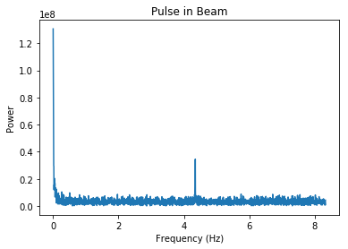
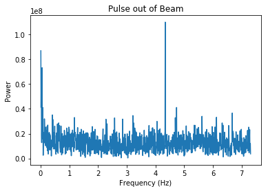
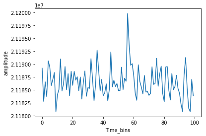
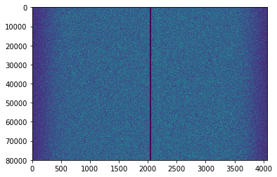

The procedure for the attempted finding of the pulsar.

------------------------------------------------------------------------
Equipment:
          * Lime SDR
          * SMA cable 
          * 40 ft radio dish

Software: 
          * Latest Lime updates as of 8/1/19

------------------------------------------------------------------------
* Python module lime_spectrometer.py used to take data from 40ft radio telescope.
 * Used to ensure no data would be lost or dropped during collection
 * 
 
* Procedure:
 * Plug Lime SDR directly into the computer and attatch sma cables to RX1 port in the lime and to either A or B channel of the antenna reciever.
 * Turn on telescope motor and turn dish to position of pulsar at the meridian (54.6 degrees on 8/28/19)
 * Test the lime to ensure working properly
  * Done by running the lime_spectrometer program and seeing no data is dropped for at least a minute
  * If data is dropped, unplug and replug until this stops, or decrease the sampling rate
 * Set the sampling rate to 20MHz, antenna to LNAW, and test gains through gnuradio histogram plots
 * Two minutes before when pulsar crosses, start program and run until at least two minutes afterwards. 
  * Run for longer if you want to compare when the pulsar was in the beam to when it wasn't.
 * When sufficient data has been collected, close the program

* Analysis:
 * Run data through the Pulsar_detection_40ft.ipynb file to search for the pulsar.

Conclusion from summer 2019 viewing:

* While initially it seemed that the pulsar had been detected, it was found that it was actually an RFI spike that conviniently had a similar SNR to what the pulsar should be.
 * 
 * 
 * Established by comparing the on and off pulsar data.

* Additionally, when folding was performed, the pulsar could not be seen.
 * Can be seen here with the folding that no pulse can be seen
  *
 * Thus I believe that the RFI is right on top of where the pulsar is, or the pulsar signal is too weak that is is buried by the noise.
  * Also evidenced by the raw data plot
  * 

